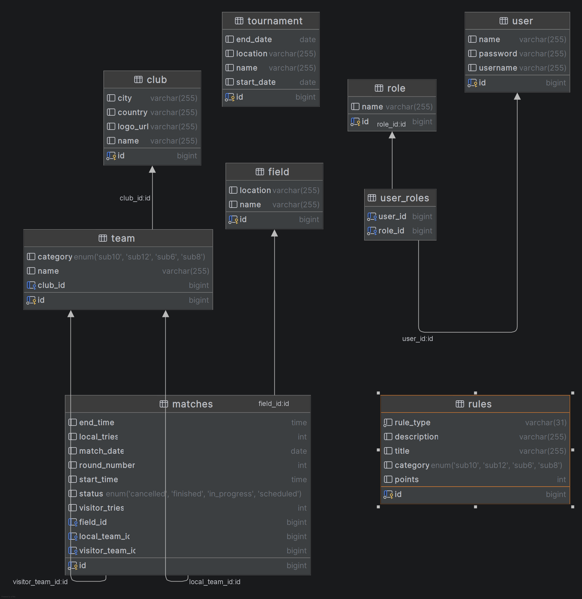
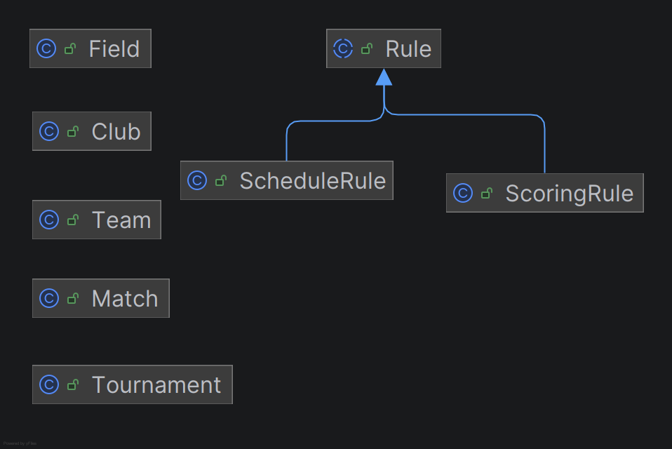
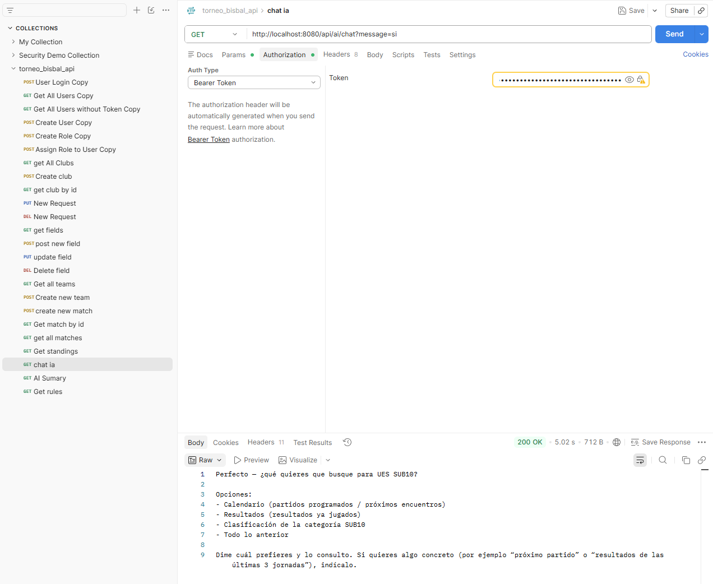

Torneo Germans Bisbal UES API

Héctor Lima Hevia

Proyecto Final Bootcamp Backend Development - Ironhack

## Índice

- Descripción
- Tecnologías utilizadas
- Funcionalidades principales
- Modelo de datos
- Herencia JPA
- Seguridad
- Inteligencia Artificial
- Endpoints destacados
- Diagrama ERD
- Mejoras futuras
- Repositorio

## Descripción:

Este proyecto consiste en una API REST desarrollada con Java y Spring Boot para gestionar el Torneo Germans Bisbal UES, un torneo de rugby base organizado por la UE Santboiana.

La aplicación permite gestionar clubes, equipos, campos, partidos y reglas del torneo. Además, incorpora una funcionalidad de Inteligencia Artificial basada en OpenAI capaz de responder preguntas utilizando información real almacenada en la base de datos.

Proyecto desarrollado como trabajo final del Bootcamp Backend Development de Ironhack.

## Tecnologías utilizadas:
Java 25
Spring Boot 4
Spring Data JPA
Spring Security
JWT
MySQL
Lombok
Maven
Spring AI
OpenAI GPT-4o-mini
Postman
Git y GitHub
Funcionalidades principales
Gestión de clubes.
Gestión de equipos.
Gestión de campos.
Gestión de partidos.
Clasificación automática por categorías.
Autenticación mediante JWT.
Inteligencia Artificial integrada mediante OpenAI.
Modelo de datos

## Arquitectura

La aplicación sigue una arquitectura en capas:

- Controller
- Service
- Repository
- Entity / DTO

Las operaciones CRUD se gestionan mediante Spring Data JPA y la seguridad mediante Spring Security y JWT.

## Las entidades principales del proyecto son:

Club
Team
Field
Match
Rule
Herencia JPA

Para cumplir los requisitos del proyecto se ha implementado herencia JPA utilizando la estrategia:

@Inheritance(strategy = InheritanceType.SINGLE_TABLE)

Entidad padre:

Rule

Entidades hijas:

ScoringRule
ScheduleRule
Seguridad

La aplicación utiliza autenticación JWT y dispone de dos roles:

ROLE_ADMIN

Puede gestionar todas las entidades del sistema.

ROLE_USER

Puede consultar información y utilizar la funcionalidad de Inteligencia Artificial.

## Reglas de negocio implementadas:
Un equipo no puede jugar contra sí mismo.
Los equipos deben pertenecer a la misma categoría.
No se permiten tries negativos.
La hora de finalización debe ser posterior a la de inicio.
Un campo no puede tener dos partidos simultáneos.
Un equipo no puede disputar dos partidos al mismo tiempo.

## Inteligencia Artificial:

La IA ha sido desarrollada utilizando Spring AI y OpenAI.

Puede responder preguntas relacionadas con:
Clasificaciones.
Equipos.
Partidos.
Reglas del torneo.

La IA utiliza Tool Calling para consultar información real de la base de datos y dispone de memoria conversacional asociada al usuario autenticado.

## Endpoints destacados:
Login
POST /login
Clasificación
GET /api/standings/{category}

Reglas
GET /api/rules
IA
GET /api/ai/chat?message=...

## Diagrama ERD

## Diagrama clases

## Ejemplo de conversación

## Mejoras futuras:

Gestión de jugadores.
Estadísticas individuales.
Generación automática de calendarios.
Predicciones mediante IA.

Enlaces de interes:
Tablero de proyecto en Trello.
https://trello.com/invite/b/6a158e476e666c95a3264e03/ATTIc069c00a3dea0b8a8d616c8d599d0b07297379CE/proyecto-final-ironhacktorneo-app-web

## Repositorio
https://github.com/hectorlimahevia/torneo-germans-bisbal-api