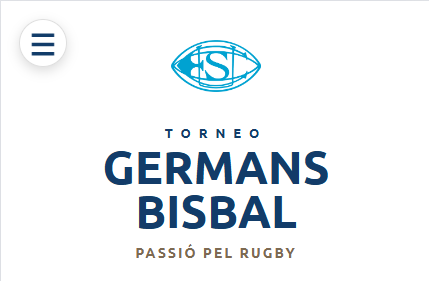

# 🏉 Torneo Germans Bisbal UES

<div align="center">


</div>

---

> **Official tournament management platform for the Germans Bisbal Youth Rugby Tournament.**

Torneo Germans Bisbal UES is a full-stack web application developed to manage every aspect of a youth rugby tournament.

The platform allows visitors to consult match schedules, standings, participating teams and tournament rules, while administrators can securely manage the competition through a complete administration dashboard.

The project was initially developed as the **Final Project of the Ironhack Amazon Backend Bootcamp** and is currently evolving into the official management platform of the real tournament.

---

# 📸 Preview

<h2>Home</h2>

<p>
- Tournament logo
- Latest Matches
- About Tournament
- Sponsors Carousel
</p>

<p align="center">
    
</p>

---

# ✨ Features

## 🌍 Public Area

- Browse tournament information
- View participating teams
- View match schedule
- View standings
- Tournament rules
- Sponsors section
- Fully responsive interface

---

## 👤 Registered Users

- Secure authentication
- User registration
- AI Tournament Assistant

---

## 🛠 Administrator Panel

- Create matches
- Update match results
- Delete matches
- Create playing fields
- Delete fields
- Manage users
- Promote users to administrators
- Remove administrator permissions
- Tournament statistics dashboard

---

# 🧠 AI Assistant

The application integrates an AI assistant powered by **Spring AI** and **OpenAI**.

Users can ask questions such as:

- Who is leading the SUB10 category?
- Explain the scoring system.
- Which matches are scheduled today?
- Which teams play in SUB12?
- Explain the tournament rules.

The assistant generates contextual answers based on tournament information.

---

<h2>AI Assistant</h2>

<p> Screenshot of the AI assistant answering a real tournament question.</p>

<p align="center">
    
</p>

---

# 🏗 Architecture

```text
                Vue 3 Frontend
                      │
                    Axios
                      │
                REST API
                      │
              Spring Boot
                      │
          Spring Security + JWT
                      │
             Spring Data JPA
                      │
                  MySQL
                      │
             Spring AI + OpenAI
```

---

# 🛠 Technology Stack

## Backend

- Java 25
- Spring Boot
- Spring Security
- Spring Data JPA
- JWT Authentication
- MySQL
- Spring AI

## Frontend

- Vue 3
- Vue Router
- Axios
- Chart.js
- Font Awesome
- CSS3

## Development Tools

- IntelliJ IDEA
- VS Code
- Git
- GitHub
- Postman

---

# 📁 Project Structure

```text
backend
├── controller
├── dto
├── exception
├── model
├── repository
├── security
├── service

frontend
├── api
├── assets
├── components
├── composables
├── constants
├── router
├── views
```

---

# 📸 Application Screenshots

## Imagen 3

**Login**

Desktop login page with custom design.

---

## Imagen 4

**Register**

User registration page.

---

## Imagen 5

**Home**

Home page highlighting:

- Latest Matches
- Sponsors Carousel
- Tournament presentation

---

## Imagen 6

**Teams**

Teams page displaying:

- Club logos
- Categories
- Responsive cards
- Blue accent border

---

## Imagen 7

**Matches**

Match schedule including:

- Teams
- Field
- Date
- Time
- Match status

---

## Imagen 8

**Standings**

Tournament standings ordered by points.

---

## Imagen 9

**Rules**

Rules page with scoring system and tournament schedule.

---

## Imagen 10

**Administration Dashboard**

Complete administrator dashboard showing:

- Statistics
- Charts
- Match management
- Navigation tabs

---

## Imagen 11

**User Management**

Administrator view showing:

- User search
- Role badges
- Promote/Demote actions

---

# 🔐 Security

Authentication is implemented using **JWT (JSON Web Tokens)**.

Available roles:

- ROLE_USER
- ROLE_ADMIN

Protected endpoints require authentication and role validation.

---

# 🗄 Database

The application uses **MySQL** together with **Spring Data JPA**.

## Imagen 12

**Entity Relationship Diagram**

Insert the complete database ERD exported from MySQL Workbench.

---

# ⚙ Installation

## Clone repository

```bash
git clone https://github.com/hectorlimahevia/torneo-germans-bisbal.git
```

---

## Quickstart with Docker

The fastest way to run the whole stack (MySQL + backend + frontend) locally:

```bash
cp .env.example .env
docker compose up --build
```

Frontend: `http://localhost:8081` · Backend: `http://localhost:8080`.

---

## Manual setup (without Docker)

### Backend

```bash
cd backend

./mvnw spring-boot:run
```

### Frontend

```bash
cd frontend

npm install

npm run dev
```

See [SETUP.md](./SETUP.md) for full local setup details, and [DEPLOY.md](./DEPLOY.md) for deploying to production (Railway, a VPS, or split hosting).

---

# 🔑 Configuration

Before running the application configure:

- MySQL database
- JWT Secret
- OpenAI API Key
- application.yaml

---

# 🚀 Future Improvements

- Live match events
- Push notifications
- Player statistics
- Match timeline
- Progressive Web App (PWA)
- Multi-tournament support
- Automatic fixture generation
- Public REST API

---

# 👨‍💻 Author

**Héctor Javier Lima Hevia**

GitHub

https://github.com/hectorlimahevia

LinkedIn

(Add your LinkedIn profile)

---

# 🎥 Demo

## Imagen 13

Animated GIF showing the complete workflow:

Home → Login → Teams → Matches → Admin Dashboard → AI Assistant

This GIF should be placed at the end of the README to summarize the whole application.