# 🏉 Torneo Germans Bisbal UES

<div align="center">


</div>

---

> **Tournament management platform for the Germans Bisbal Youth Rugby Tournament**, organised by the U.E. Santboiana rugby school.

Torneo Germans Bisbal UES is a full-stack web application that manages every operational aspect of a youth rugby tournament: match scheduling, live results, standings by category, participating teams and rules — with a secured admin dashboard and an AI assistant that answers questions about the tournament in natural language.

The project started as the **final project of the Ironhack Backend Development Bootcamp** and has since evolved past the bootcamp scope: it now has a redesigned UI/UX, a hardened production configuration (externalised secrets, configurable CORS, a reverse-proxy setup) and a full Docker Compose stack, on its way to becoming the real platform used by the tournament organisers.

**Why it's worth a look:** it's not a CRUD toy. It combines JWT-based role security, JPA single-table inheritance for a flexible rules engine, an LLM-backed assistant grounded in live database data, and a deployment-ready container setup — the kind of decisions a real production app has to make.

---

## 📑 Table of contents

- [Live demo](#-live-demo)
- [Preview](#-preview)
- [Features](#-features)
- [AI Assistant](#-ai-assistant)
- [Architecture](#-architecture)
- [Technology stack](#-technology-stack)
- [Project structure](#-project-structure)
- [API overview](#-api-overview)
- [Security](#-security)
- [Database](#-database)
- [Screenshots](#-screenshots)
- [Installation](#-installation)
- [Configuration](#-configuration)
- [Deployment](#-deployment)
- [Roadmap](#-roadmap)
- [Author](#-author)

---

## 🚀 Live demo

**[gentle-endurance-production-6f4b.up.railway.app](https://gentle-endurance-production-6f4b.up.railway.app/)** — deployed on Railway as three separate services (MySQL, Spring Boot backend, Vue/nginx frontend). See [DEPLOY.md](./DEPLOY.md) for the full deployment guide.

---

## 📸 Preview

<p align="center">
    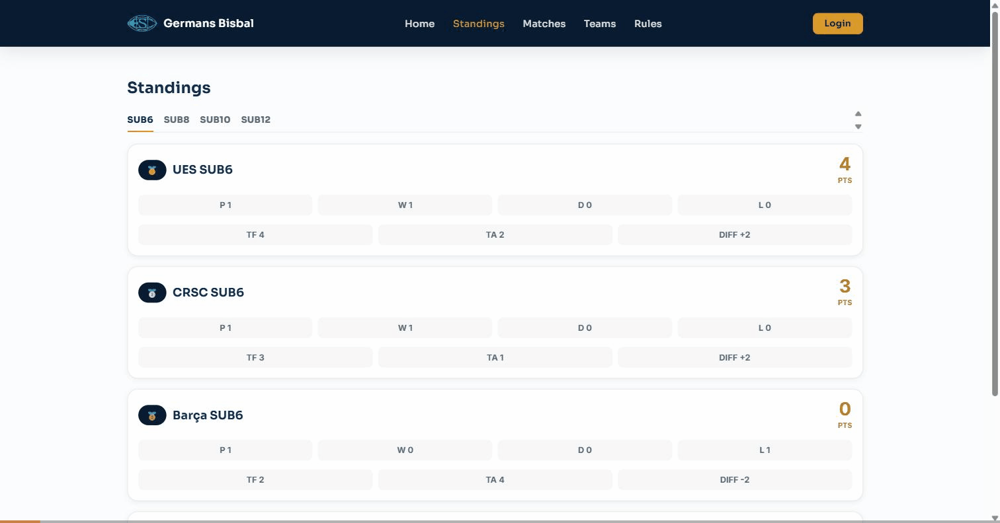
</p>

<p align="center"><sub>Live navigation demo — see the <a href="#-screenshots">Screenshots</a> section below for a static, page-by-page gallery.</sub></p>

---

## ✨ Features

### 🌍 Public area

- Browse tournament information, rules and sponsors
- View participating teams and clubs, filterable by category
- View match schedule with date, time, field and live status
- View standings by category, ranked by points
- Fully responsive interface (mobile-first, desktop-enhanced)

### 👤 Registered users

- Secure JWT-based authentication and self-service registration
- AI Tournament Assistant with conversational memory

### 🛠 Administrator panel

- Create, update and delete matches and results
- Create and delete playing fields
- Manage users: search, promote to admin, revoke admin permissions
- Tournament statistics dashboard with charts by category

---

## 🧠 AI Assistant

The application integrates a conversational assistant powered by **Spring AI** and the **OpenAI** chat API, grounded in the tournament's real data (not a generic chatbot — it queries live matches, standings and rules).

Example questions it can answer:

- "Who is leading the SUB10 category?"
- "Explain the scoring system."
- "Which matches are scheduled today?"
- "Which teams play in SUB12?"

Exposed through two endpoints (`GET /api/ai/chat`, `GET /api/ai/summary/{category}`), with per-user conversation memory and role-gated access (`ROLE_USER` / `ROLE_ADMIN` only).

<p align="center">
    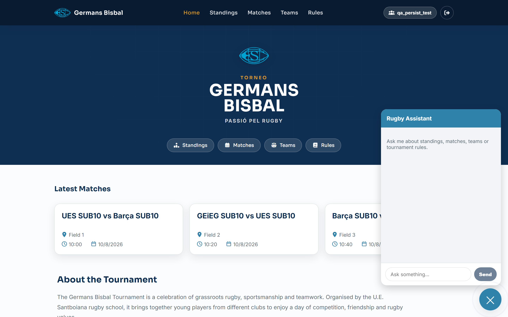
</p>

---

## 🏗 Architecture

```text
                 Vue 3 SPA (Vite)
                       │
                     Axios
                       │
         ─────────────────────────────
         nginx (prod) — reverse proxy
         ─────────────────────────────
                       │
                  REST API (/api)
                       │
                 Spring Boot 4
                       │
        Spring Security + JWT filters
                       │
               Spring Data JPA
                       │
                    MySQL 8
                       │
              Spring AI + OpenAI
```

In production, the frontend is served by nginx, which reverse-proxies `/api/*` straight to the backend container — so the browser only ever talks to one origin and CORS never comes into play. Locally, Vite's dev server talks to Spring Boot directly. See [`frontend/docker/nginx.conf`](./frontend/docker/nginx.conf) and [`docker-compose.yml`](./docker-compose.yml).

---

## 🛠 Technology stack

### Backend

- Java 25, Spring Boot 4
- Spring Security + JWT (stateless sessions)
- Spring Data JPA / Hibernate (single-table inheritance for the `Rule` hierarchy)
- Spring AI + OpenAI (`gpt-5.4-mini`)
- MySQL 8
- Maven (wrapper included, no local install required)

### Frontend

- Vue 3 (Composition API, `<script setup>`)
- Vue Router
- Axios
- Chart.js / vue-chartjs
- Font Awesome
- Plain CSS with design tokens (custom properties) — no framework lock-in

### Infrastructure

- Docker + Docker Compose (MySQL, backend, frontend as separate services)
- nginx (static hosting + API reverse proxy in production)
- Deploy target: Railway (or any Docker-compatible host)

### Tooling

- IntelliJ IDEA / VS Code
- Postman (API collection used during development)
- ESLint + oxlint + Prettier (frontend)
- Git / GitHub

---

## 📁 Project structure

```text
torneo-germans-bisbal/
├── docker-compose.yml
├── SETUP.md                 # local setup guide
├── DEPLOY.md                # production deployment guide
│
├── backend/
│   ├── Dockerfile
│   └── src/main/java/.../
│       ├── controller/
│       ├── dto/
│       ├── exception/
│       ├── model/            # entities, incl. Rule inheritance hierarchy
│       ├── repository/
│       ├── security/         # JWT filters, SecurityConfig, CORS
│       └── service/
│
└── frontend/
    ├── Dockerfile
    ├── docker/nginx.conf
    └── src/
        ├── api/               # Axios instance + interceptors
        ├── assets/            # design tokens, global styles
        ├── auth/
        ├── components/        # incl. admin/ and auth/ subfolders
        ├── composables/
        ├── router/
        └── views/
```

---

## 🔌 API overview

All endpoints are prefixed with `/api`. Full request/response details live in the Postman collection used during development; below is the resource map.

| Resource       | Endpoints                                                              | Public access                 |
| -------------- | ----------------------------------------------------------------------- | ------------------------------ |
| Auth           | `POST /login`, `POST /register`, `POST /refresh`, `POST /logout`      | ✅ public                     |
| Matches        | `GET /matches`, `GET /matches/{id}`, `POST` / `PUT` / `DELETE`         | reads public, writes admin-only |
| Standings      | `GET /standings/{category}`                                            | ✅ public                     |
| Teams          | `GET /teams`, `GET /teams/{id}`, `POST` / `PUT` / `DELETE`             | reads public, writes admin-only |
| Clubs          | `GET /clubs`, `GET /clubs/{id}`, `POST` / `PUT` / `DELETE`             | reads public, writes admin-only |
| Fields         | `GET /fields`, `GET /fields/{id}`, `POST` / `PUT` / `DELETE`           | reads public, writes admin-only |
| Rules          | `GET /rules`, `GET /rules/{id}`, `POST` / `PUT` / `DELETE`             | reads public, writes admin-only |
| Users & roles  | `GET /users`, `POST /users`, `POST /roles`, `POST /roles/add-to-user`, `POST /roles/remove-from-user` | authenticated / admin-only |
| AI Assistant   | `GET /ai/chat?message=...`, `GET /ai/summary/{category}`               | authenticated users            |

---

## 🔐 Security

Authentication is stateless, implemented with **JWT** via custom `CustomAuthenticationFilter` / `CustomAuthorizationFilter` filters on top of Spring Security (no server-side sessions, `SessionCreationPolicy.STATELESS`).

Two roles are supported:

- `ROLE_USER` — registered tournament followers (AI assistant access)
- `ROLE_ADMIN` — full write access to matches, teams, clubs, fields, rules and user management

Every write endpoint (`POST` / `PUT` / `DELETE`) is restricted to `ROLE_ADMIN`; read endpoints for tournament data are public by design so anyone can follow the competition. CORS origins are externalised via the `APP_CORS_ALLOWED_ORIGINS` environment variable rather than hardcoded, so the same build can move from local dev to production without a code change. The JWT signing key is also externalised (`APP_JWT_SECRET`) rather than hardcoded.

**Session persistence.** Short-lived access tokens (15 min) are paired with a rotating refresh token: on login, the API also sets an `httpOnly` cookie holding a 30-day refresh token, stored **hashed** (SHA-256) in the database — the raw token only ever exists in that cookie, never at rest. Each use rotates it (the old one is revoked, a new one issued), and `POST /api/logout` revokes it server-side, not just client-side. The frontend transparently calls `POST /api/refresh` when an access token expires, so the user stays logged in without re-entering credentials.

---

## 🗄 Database

MySQL 8 with Spring Data JPA / Hibernate (`ddl-auto: update`). Notable design decision: **rules use single-table JPA inheritance** (`Rule` → `ScheduleRule`, `ScoringRule`), which lets scoring rules and schedule rules share a table and a repository while keeping their own fields and validation.

<p align="center">
    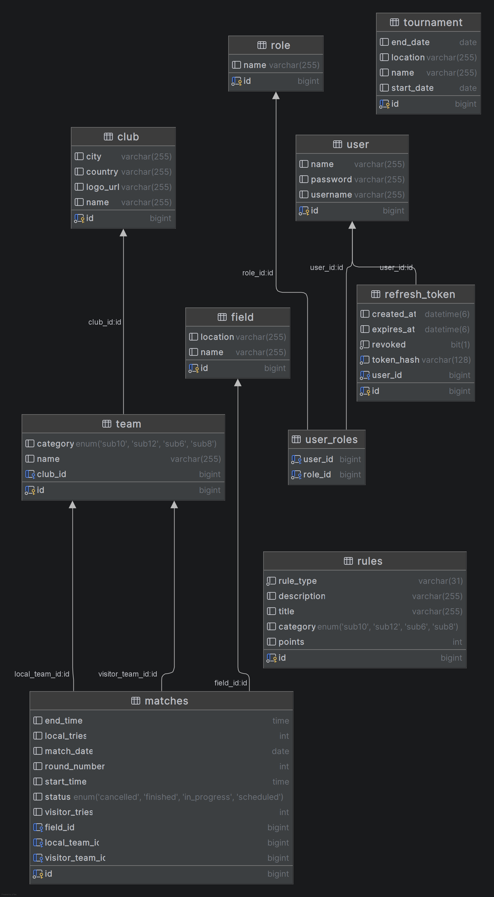
</p>

<p align="center"><sub>Entities: <code>tournament</code>, <code>club</code>, <code>team</code>, <code>field</code>, <code>matches</code>, <code>rules</code>, <code>user</code>, <code>role</code>, <code>user_roles</code>.</sub></p>

<p align="center">
    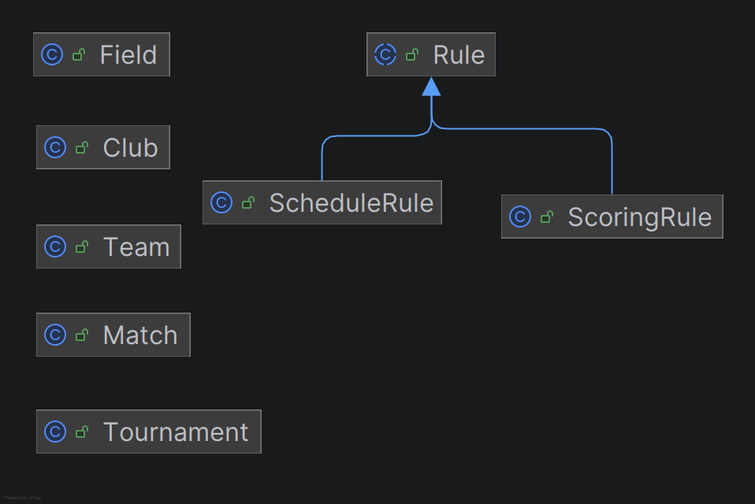
</p>

---

## 📸 Screenshots

<p align="center">
    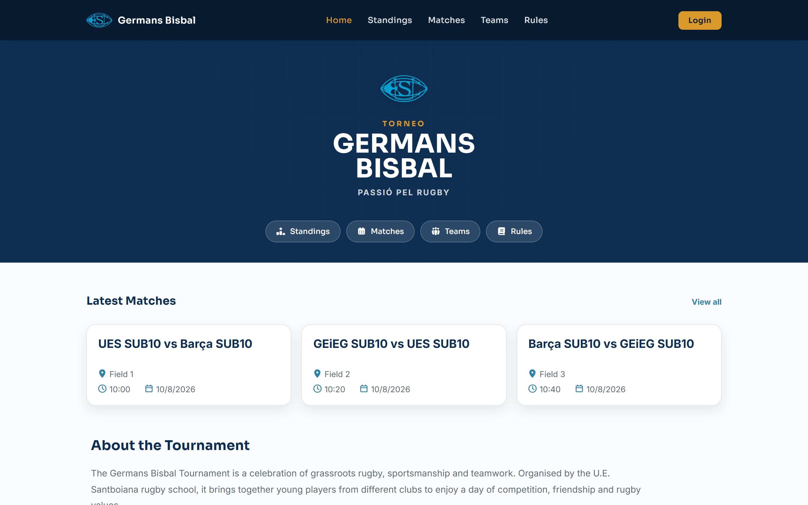<br><sub>Home</sub>
</p>

<p align="center">
    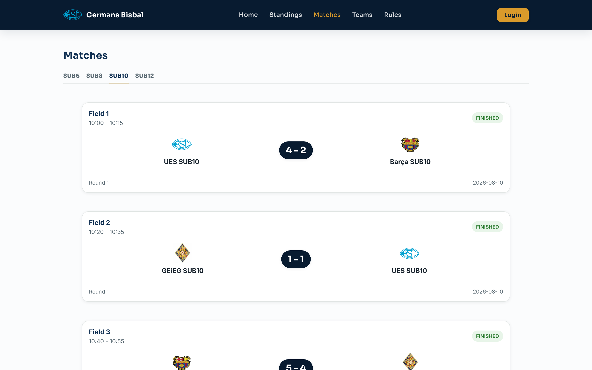<br><sub>Matches</sub>
</p>

<p align="center">
    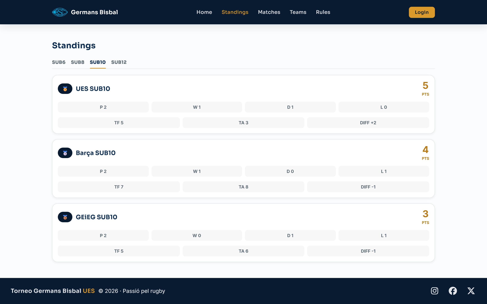<br><sub>Standings</sub>
</p>

<p align="center">
    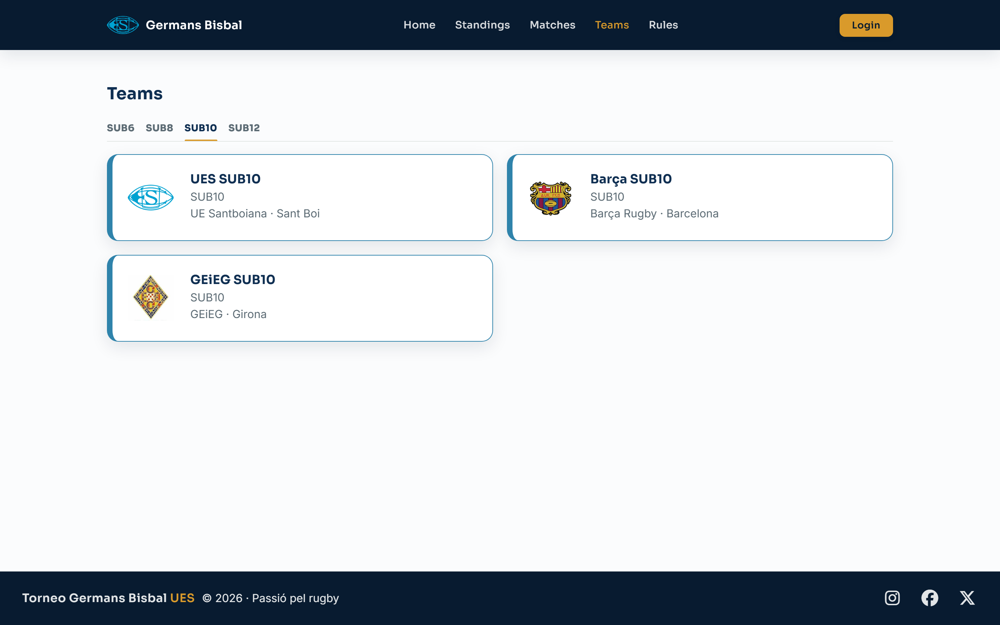<br><sub>Teams</sub>
</p>

<p align="center">
    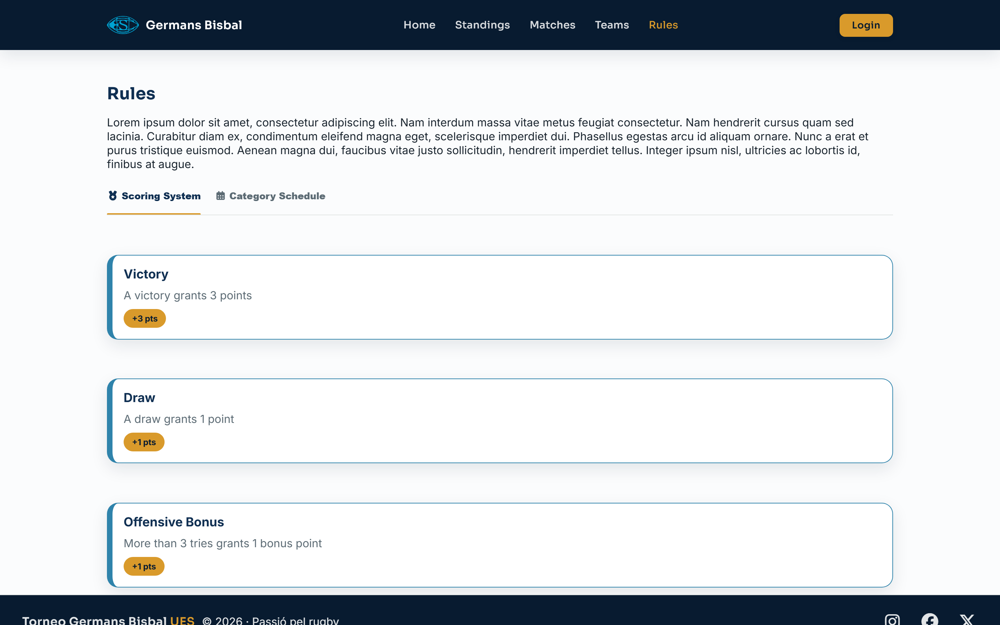<br><sub>Rules</sub>
</p>

<p align="center">
    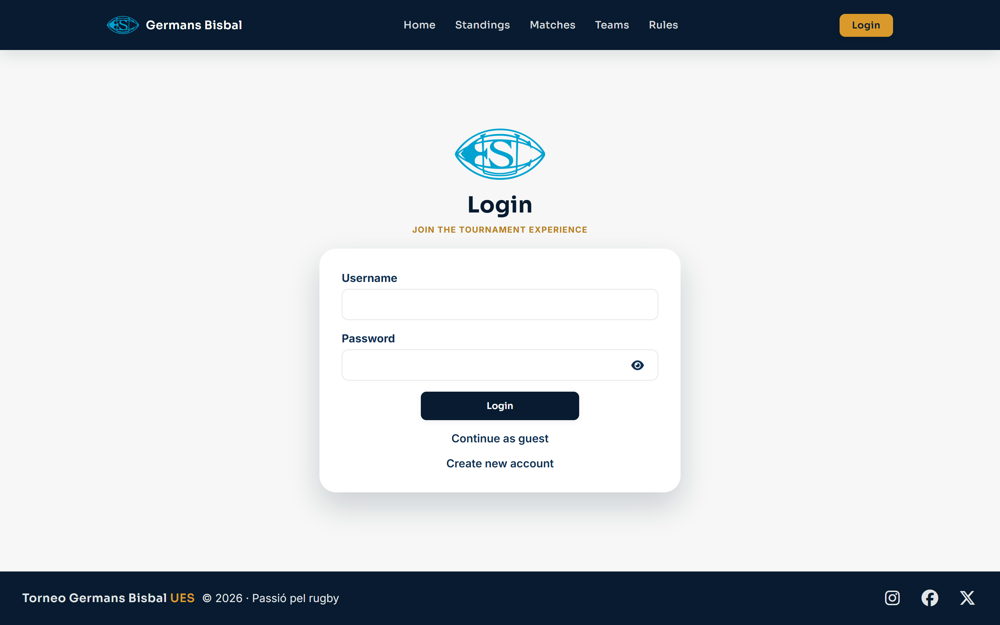<br><sub>Login</sub>
</p>

<p align="center">
    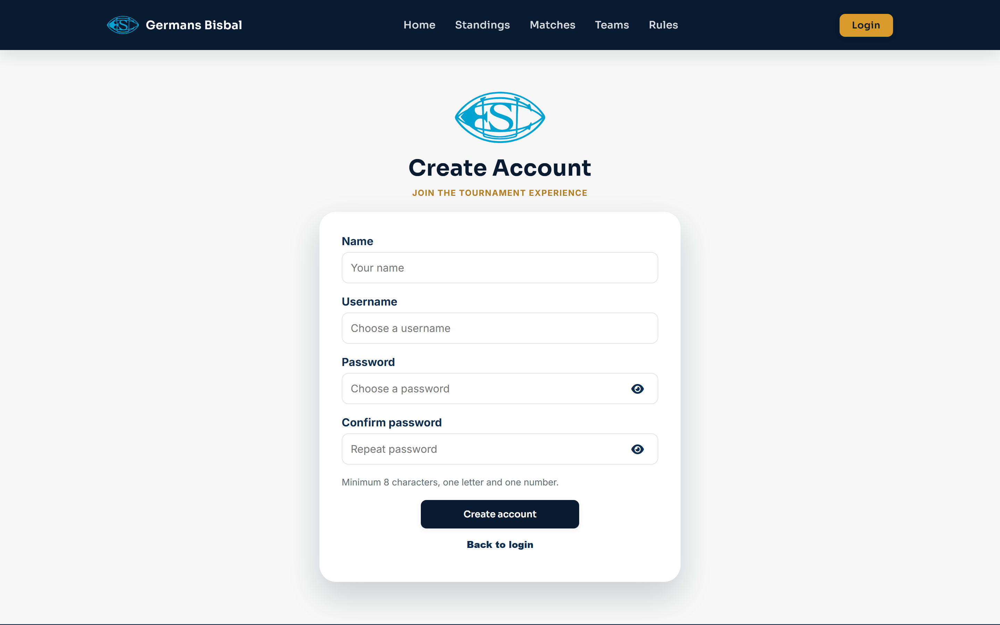<br><sub>Register</sub>
</p>

<p align="center">
    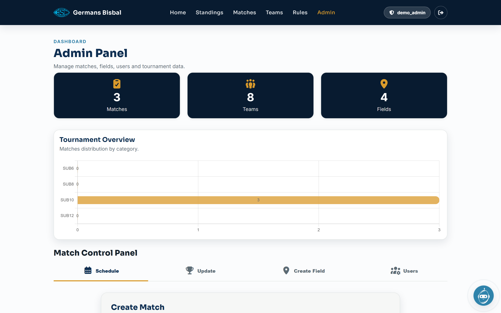<br><sub>Admin dashboard</sub>
</p>

<p align="center">
    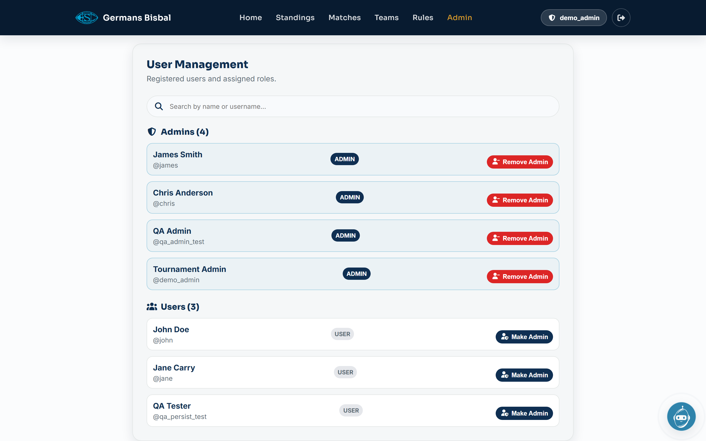<br><sub>User management</sub>
</p>

<p align="center">
    <br><sub>AI Assistant — sample conversation mockup styled after the live widget; the real assistant needs <code>OPENAI_API_KEY</code> set to answer questions.</sub>
</p>

---

## ⚙ Installation

### Clone repository

```bash
git clone https://github.com/hectorlimahevia/torneo-germans-bisbal.git
```

### Quickstart with Docker

The fastest way to run the whole stack (MySQL + backend + frontend) locally:

```bash
cp .env.example .env
docker compose up --build
```

Frontend: `http://localhost:8081` · Backend: `http://localhost:8080`.

### Manual setup (without Docker)

**Backend**

```bash
cd backend
./mvnw spring-boot:run
```

**Frontend**

```bash
cd frontend
npm install
npm run dev
```

See [SETUP.md](./SETUP.md) for full local setup details (prerequisites, database creation, environment variables).

---

## 🔑 Configuration

Configuration is externalised via environment variables (see [`.env.example`](./.env.example)), with sane local defaults so the app still runs out of the box:

| Variable                     | Purpose                                          | Default (local)                        |
| ----------------------------- | ------------------------------------------------- | ---------------------------------------- |
| `PORT`                       | Backend HTTP port                                | `8080`                                   |
| `SPRING_DATASOURCE_URL`      | MySQL JDBC URL                                   | `jdbc:mysql://localhost:3306/torneo_germans_bisbal_db` |
| `SPRING_DATASOURCE_USERNAME` | MySQL user                                       | `root`                                   |
| `SPRING_DATASOURCE_PASSWORD` | MySQL password                                   | *(empty)*                                |
| `OPENAI_API_KEY`             | Enables the AI Assistant                         | *(empty — feature disabled if unset)*    |
| `APP_CORS_ALLOWED_ORIGINS`   | Comma-separated origins allowed to call the API  | `http://localhost:5173,http://localhost:4173` |
| `APP_JWT_SECRET`             | Key used to sign access tokens. **Required** — generate with `openssl rand -base64 48` | *(placeholder — override before deploying)* |
| `APP_JWT_ACCESS_EXP_MIN`     | Access token lifetime, in minutes                | `15`                                     |
| `APP_REFRESH_EXP_DAYS`       | Refresh token lifetime, in days                  | `30`                                     |
| `APP_COOKIE_SECURE`          | `Secure` flag on the refresh token cookie — keep `true` behind HTTPS, only disable for local HTTP dev | `true`                                   |
| `VITE_API_BASE_URL`          | Frontend → backend base URL (build-time)         | `http://localhost:8080` in dev, empty (relative, proxied) in production |

---

## 🚢 Deployment

The project ships with a `Dockerfile` for the backend (multi-stage Java 25 build), a `Dockerfile` for the frontend (Vite build served by nginx with an API reverse proxy) and a `docker-compose.yml` that wires both up with MySQL. Full deployment instructions — including a guided **Railway** setup — are in [DEPLOY.md](./DEPLOY.md).

---

## 🚀 Roadmap

- Live match events / real-time score updates
- Push notifications
- Player statistics
- Match timeline view
- Progressive Web App (PWA) support
- Multi-tournament support
- Automatic fixture generation
- Broader automated test coverage (currently limited to the Spring context load test)
- Public read-only API for third-party integrations

---

## 👨‍💻 Author

**Héctor Javier Lima Hevia**

- GitHub: [github.com/hectorlimahevia](https://github.com/hectorlimahevia)
- LinkedIn: [linkedin.com/in/hectorjlima](https://www.linkedin.com/in/hectorjlima/)
